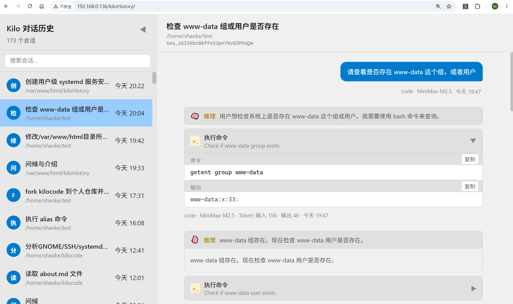
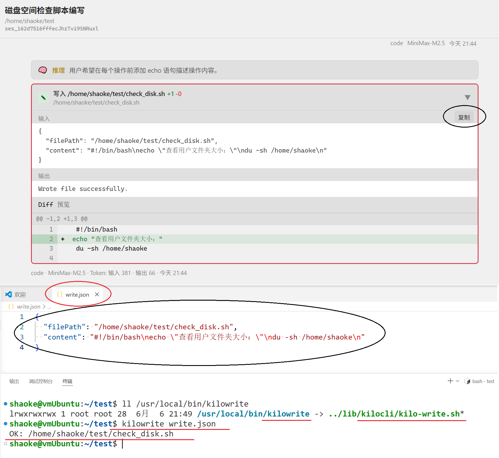
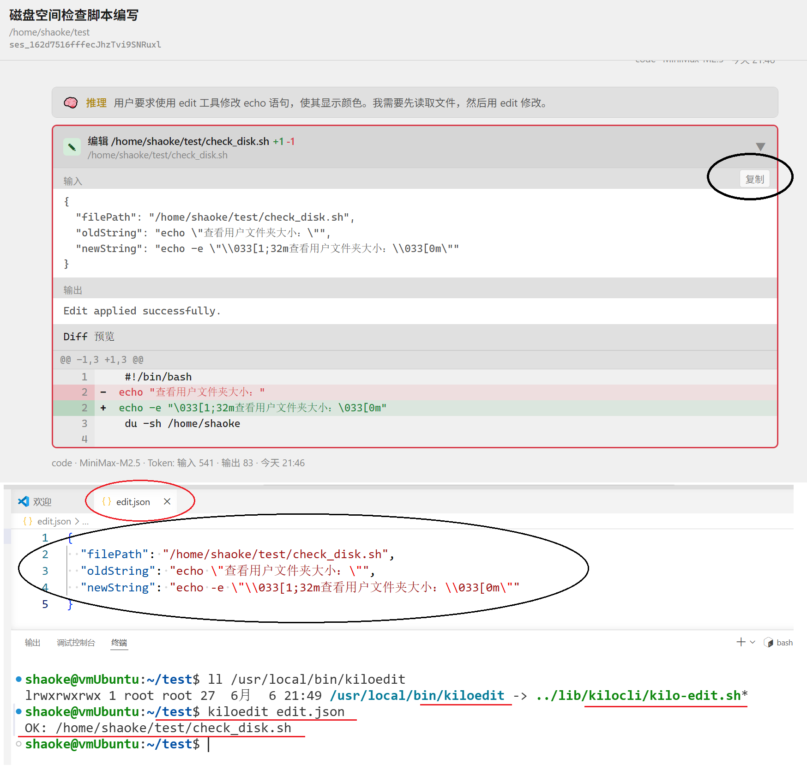

# 关于如何修改全局配置

全局配置文档在路径: ~/.config/kilo/kilo.jsonc
需要在这个里面添加如下配置即可：

  "bwrap": {
    "tmpfs": ["/tmp", "/root", "/var", "/opt", "/mnt", "/media", "/run", "/srv", "/boot"],
    "symlink": [
      {"from": "usr/bin", "to": "/bin"},
      {"from": "usr/lib", "to": "/lib"},
      {"from": "usr/lib64", "to": "/lib64"},
      {"from": "usr/sbin", "to": "/sbin"}
    ],
    "ro_bind": ["/usr", "/etc", "/home/username/.local/share/kilo"],
    "rw_bind": ["/home/username/.kilo"]
  }

上面的 /home/username/.local/share/kilo 是存放 kilo.db 的地方需要允许只读的权限
上面的 /home/username/.kilo 是存放 kilo 自己开发和安装skill 的位置，需要读写权限

# 关于 linux 下沙箱如何其作用的说明

在使用 ai 进行辅助开发的过程中，总是会发现，ai 一旦具备了权限，它可以肆意的阅读和修改超出明显合理边界的文件
对当前项目之外的部分，产生严重的影响，而且它修改错误，也不会负责，于是我在 ai 调用常用工具的时候进行了代码层面的物理限制
比如，它调用 write 和 edit 工具的时候，需要传递具体修改的文件路径作为参数，在 kilo 插件代为执行这些操作之前
会对该文件路径进行辨别，如果该文件路径不是在当前正在打开的项目以内，直接禁止该操作，并反馈给 ai

除了上面的两个工具之外，ai 还会申请调用 bash 工具，在 bash 工具里面，它可以不受限制的执行任何的的操作
于是这个时候，就需要使用沙箱，经过权衡，我选择了 bwrap 沙箱工具，它的调用时机，就是在每一次 ai 申请 bash 调用的时候
上面的配置文件，就是规定了凡是被设定为 tmpfs 的路径，在 ai 和 kilo 插件本身看来都是空目录
设置为 ro_bind 的只读目录，类似于挂载效果，rw_bind 为可读写的目录

以上的限制，可以在代码层级，最大限度的 ai 操作范围，且允许它执行诸如 find, mv, touch, echo 等正常合规命令

# 添加了 extraSkills 文件夹

这个里面是几个比较好用的 skill，在安装插件的时候，并不会被默认包含
你需要将该目录下所有 skills 直接复制到 /home/username/.kilo/skills/ 目录下即可

# 增加了 kiloHistory 文件夹，离线查看所有 kilo 对话记录

部署并安装该服务之后，使你可以通过局域网 ip 地址，浏览全部的 kilo 对话历史记录
包括 kilo ui 不显示的子会话也会展现， 

这个里面的代码是纯静态的，不需要编译，部署它的方式就是在 linux 系统里面
首先安装好 nginx 服务，有了这个服务之后，会出现 /var/www/html/ 文件夹
直接将该项目的 kiloHistory 整个文件夹复制到 /var/www/html/ 下面
然后，执行 /var/www/html/kiloHistory/install-kiloHistory.sh 这个脚本
它会安装一个名为 kiloHistory.service 的用户级别的服务

注意：默认情况下 nginx 会开放 80 端口，这个服务会反代绑定 8080 端口，
使得静态网页可以读取 kilo.db 的数据库内容，如果你觉得这些端口已被占用，请自行更换

# 正确的使用 kilo-write.sh 和 kilo-edit.sh，使 ai 辅助编程的每一步都可以追溯

通过前面的 kiloHistory 的 web 展示，你已经可以阅读 kilo 中出现的你和 ai 的全部聊天记录
这个时候，发挥它最重要作用的时候来了，想象一下，在经过数个小时的和 ai 对话，它帮助你把
你手头的工作不断的修改，依次产生了修改 1，2，3，4，5，6，.....突然之间你发现，从修改 65 或者 67 开始
它把你的工作任务彻底搞砸了，删除了某个重要库？改写某个关键函数？而且这个搞砸的修改次数，
究竟是 65 还是 67，还是之前的某个修改，你都不清楚，因为 ai 开发的速度开快，几秒钟就会对项目文件做一次修改，
你根本来不及保存它的每一次修改，并审核提交一次，它的下一次修改就已经被执行

于是，这个时候，作为会版本管理的你，只需要通过合理的 git 、svn 把一切的工作都恢复到最开始的起点 1，
你也不需要把你耗费数个小时的，和 ai 对话的过程再次重复一遍，因为同样的初始状况，同样的对话，
同一个 ai 大模型，再次执行的时候，它得到的结果就是不一样的

打开 kiloHistory 历史对话，找到其中的每一个“写入”和“编辑”，展开它们，你可以清晰的看到“输入”部分，
直接点击右侧的“复制”，这是一个标准的 json 格式文本，将“写入”的json保存成为 write.json，将“编辑”的json
保存成为 edit.json ，然后直接使用 kilocli 里面提供的 kilo-write.sh 和 kilo-edit.sh 脚本

这两个脚本，是完全模拟 kilo 插件内部，调用 write 和 edit 工具，对具体代码进行修改的实际操作过程
它们在执行的时候，分别需要一个标准的 json 格式的文本文件作为参数，就是 write.json 和 edit.json (文件名可以自定义)
你还可以图方便，把它们分别建立一个软链接，直接执行软连接 + 文件参数，你可以完美的把这数个小时，
ai 对你的项目，执行的每一次修改，重新来一次，看到结果 OK，就表示，这次操作成功复现

